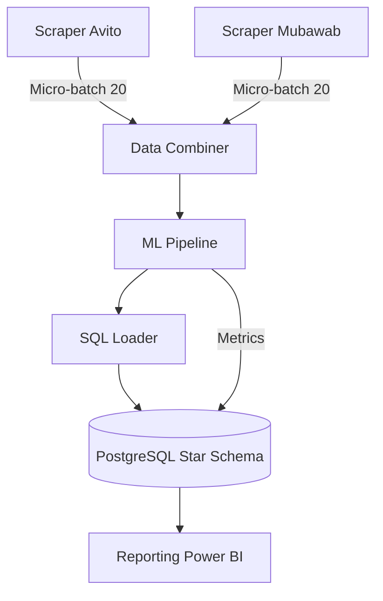

# 🏠 Documentation Confluence : Pipeline Immobilier Maroc 🚀

## 📋 1. Présentation du Projet
Ce projet est une plateforme de **Data Intelligence** bout-en-bout pour le marché immobilier marocain. Il automatise la collecte, le traitement, l'analyse prédictive (ML) et la visualisation des données en temps réel via une architecture de **micro-batching**.

---

## 🏗️ 2. Architecture Technique
Le pipeline repose sur une exécution séquentielle orchestrée par Airflow :
1.  **Ingestion** : Scraping incrémental (Selenium/Docker).
2.  **Traitement** : Nettoyage & Feature Engineering (Pandas).
3.  **ML Engine** : Prédiction de prix & Tracking de performance.
4.  **Storage** : PostgreSQL (Architecture Star Schema).
5.  **BI** : Dashboards interactifs (Power BI).

---

## 🕷️ 3. Ingestion des Données (Scraping)
**Nom de l'étape :** `Data Ingestion Layer`

Le système utilise des scrapers **stateful** (à mémoire d'état).
*   **Mécanisme** : Chaque 15 minutes, les scrapers reprennent à la dernière page visitée et s'arrêtent après **20 annonces valides**.
*   **Persistance** : L'état (`last_page`) est stocké dans `data/state/`.
*   **Technologies** : Python, Selenium, Undetected-Chromedriver.

---

## 🧹 4. Transformation & Qualité (Combiner)
**Nom de l'étape :** `Data Processing & Cleaning`

Fusionne les sources disparates dans un schéma unique.
*   **Nettoyage** : Suppression des doublons, filtrage des prix aberrants (< 50k ou > 50M MAD), validation des surfaces.
*   **Standardisation** : Uniformisation des types de biens (Appartement, Villa, etc.) et des noms de villes.
*   **Enrichissement** : Calcul automatique du `prix_m2` et du `score_equipements` (parking, piscine, etc.).

---

## 🤖 5. Intelligence Artificielle (ML Engine)
**Nom de l'étape :** `Predictive Analytics Pipeline`

Un modèle **RandomForestRegressor** est entraîné à chaque cycle pour prédire le prix des nouvelles annonces.
*   **Tracking** : Les performances du modèle (R², RMSE, MAE) sont enregistrées dans la table `model_metrics`.
*   **Features** : Localisation, Surface, Type de bien, Équipements.

---

## 🐘 6. Stockage Analytique (Star Schema)
**Nom de l'étape :** `Structured Storage Layer`

La base de données PostgreSQL utilise un **Schéma en Étoile** optimisé pour la BI :
*   **Table de Faits (`fact_annonces`)** : Contient les mesures (prix, surface) et les FK.
*   **Dimensions** : `dim_localisation`, `dim_type_bien`, `dim_source`.
*   **Vue BI (`v_dashboard_kpis`)** : Vue pré-jointe pour une connexion rapide sans jointures complexes dans Power BI.

---

## 🌊 7. Orchestration (Airflow)
**Nom de l'étape :** `Pipeline Orchestration`

Géré par Docker Compose. Le DAG `immobilier_maroc_pipeline` est configuré en mode **Micro-Batch Séquentiel** :
*   **Fréquence** : Toutes les 15 minutes (`*/15 * * * *`).
*   **Séquence** : `Avito -> Mubawab -> Combiner -> ML -> SQL`.

---

## 📊 8. Business Intelligence (Power BI)
**Nom de l'étape :** `Business Insights Layer`

*   **Connexion** : via PostgreSQL Connector sur `localhost:5433`.
*   **KPIs Clés** : 
    1. Volume Marché total.
    2. Prix Moyen au M².
    3. Part de marché par source.
    4. Évolution de la précision de l'IA (Tracking ML).
*   **Accès** : Utilisation recommandée de la vue `v_dashboard_kpis` pour une performance optimale.

---

## 🛠️ 9. Maintenance & Commandes
*   **Démarrer le système** : `docker compose up -d`
*   **Reset Data** : `docker compose down -v`
*   **Logs** : `docker compose logs -f airflow-scheduler`
